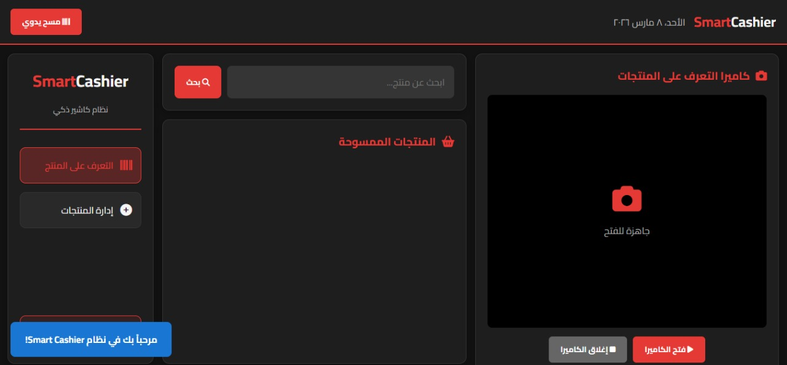
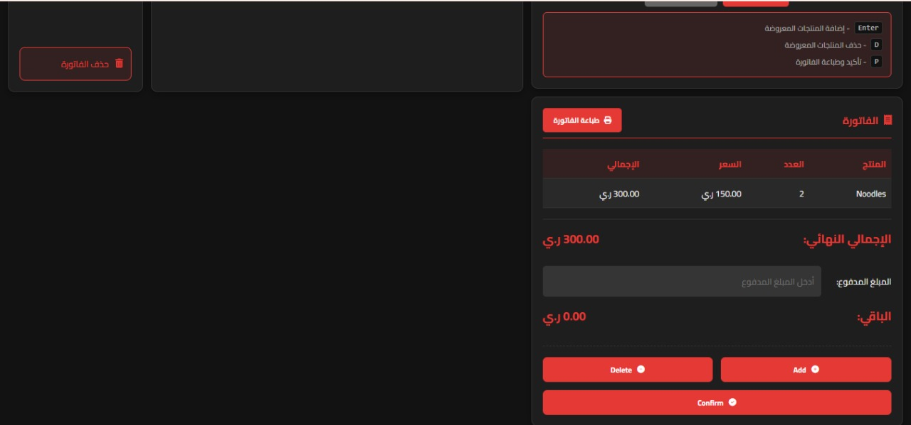
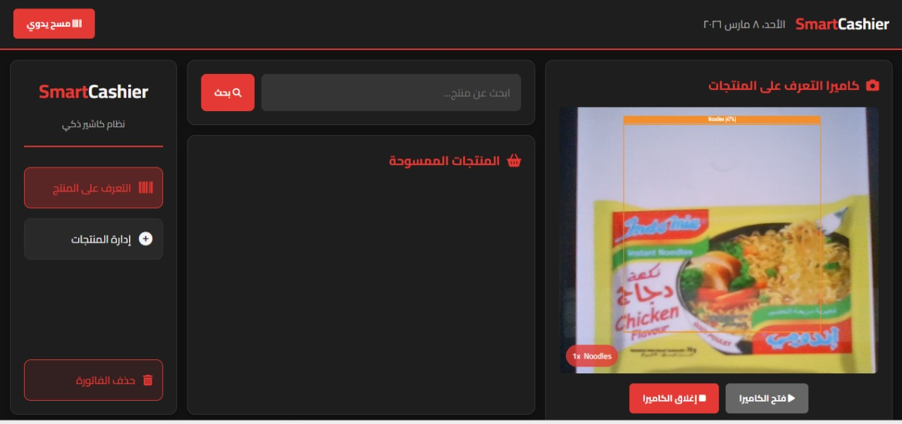
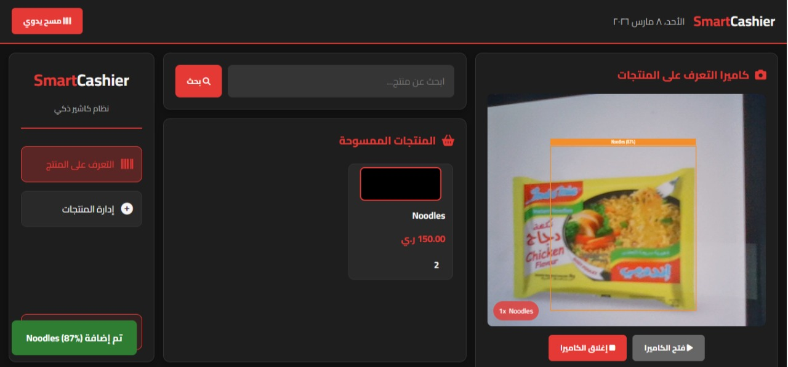
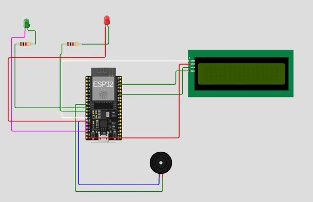
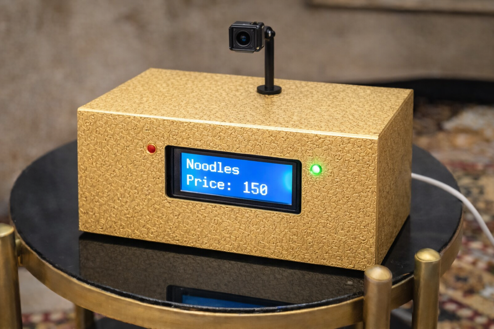

# Vision-Based Smart Cashier System

### AI + Computer Vision + Embedded Systems

---

# 1. Scientific Motivation

Retail checkout systems have remained largely unchanged for decades.
Most supermarkets still rely on **barcode-based checkout systems**, where every product must be manually scanned.

Although barcode systems are reliable, they introduce several operational limitations.

In traditional checkout systems:
```
• Each item must be individually scanned
• The cashier must manually locate the barcode
• Damaged or unreadable barcodes cause delays
• Human error can occur during product identification
```
When customers purchase many products, the checkout process becomes slow and inefficient.

With the rapid development of **Artificial Intelligence and Computer Vision**, it has become possible to automate product identification using visual recognition instead of barcode scanning.

This project explores a **Vision-Based Smart Cashier System**, where products are automatically recognized using a camera and deep learning models.

The system demonstrates how **AI, Web Systems, and Embedded Hardware** can be integrated to create an intelligent retail checkout solution.

---

# 2. Problem Statement

Traditional barcode checkout systems suffer from multiple limitations.

### Slow Checkout

Each product must be scanned individually.

Example:

20 products → 20 barcode scans

This increases customer waiting time.

---

### Human Dependency

The process depends heavily on the cashier.

Human errors may include:

```
• scanning the wrong item
• scanning an item twice
• failing to detect a damaged barcode
```
---

### Limited Automation

Barcode systems cannot operate autonomously.

They require:
```
• manual scanning
• specialized hardware
```
---

# 3. Proposed Solution

The proposed solution is a **Vision-Based Smart Cashier System**.

Instead of scanning barcodes, the system identifies products visually using **Artificial Intelligence**.

The user simply places a product in front of a camera.

The system automatically:

1. Captures the product image
2. Detects the object using YOLOv8
3. Verifies the product using feature embeddings
4. Adds the product to the invoice
5. Displays the result in the web interface
6. Sends feedback signals to hardware devices

---

# 4. System Demonstration

## User Interface





---

## AI Object Detection



---

## Product Added to Invoice



---

## Hardware System (ESP32 Prototype)



---

## Real Hardware Prototype (Physical Device)

The following image shows the **actual physical prototype** of the Vision-Based Smart Cashier device.

This device was built as a working demonstration of the smart cashier system operating in a real environment.

The prototype includes:

```
• ESP32 microcontroller
• LCD screen for product information
• Green LED indicator (successful recognition)
• Red LED indicator (unknown product)
• Buzzer for sound feedback
• Camera mounted above the device for product capture
```
The camera captures the product placed in front of the system.

The image is processed by the AI backend which performs:

1. Object detection using YOLOv8
2. Product verification using feature embeddings
3. Invoice generation
4. Hardware feedback through ESP32



---

# 5. System Architecture

The system integrates **four major subsystems**.
```
Camera
↓
Frontend Interface
↓
FastAPI Backend
↓
YOLOv8 Detection
↓
Embedding Verification
↓
Invoice Generation
↓
ESP32 Hardware Feedback
```
---

# 6. Complete Architecture Diagram

```
    ┌─────────────────────────┐
    │        Camera           │
    └────────────┬────────────┘
                 │
                 ▼
    ┌─────────────────────────┐
    │     Web Frontend        │
    │  HTML + JavaScript UI   │
    └────────────┬────────────┘
                 │
                 ▼
    ┌─────────────────────────┐
    │        FastAPI          │
    │     Backend Server      │
    └────────────┬────────────┘
                 │
                 ▼
    ┌─────────────────────────┐
    │        YOLOv8           │
    │   Object Detection AI   │
    └────────────┬────────────┘
                 │
                 ▼
    ┌─────────────────────────┐
    │  MobileNet Embedding    │
    │  Feature Verification   │
    └────────────┬────────────┘
                 │
      ┌──────────┴──────────┐
      ▼                     ▼


Invoice Generation      ESP32 Hardware
│
LCD + LED + Buzzer
```
---

# 7. AI Detection Pipeline

The AI pipeline contains **two stages**.
```
Camera Frame
↓
Image Decoding
↓
YOLOv8 Detection
↓
Bounding Box Extraction
↓
Product Crop
↓
MobileNet Feature Extraction
↓
Cosine Similarity Comparison
↓
Product Label Confirmation
```
This two-stage approach increases detection reliability.

---

# 8. Mathematical Explanation

The embedding verification step compares feature vectors using **Cosine Similarity**.

The similarity between two vectors is defined as:

similarity = (A · B) / (||A|| × ||B||)

Where:
```
• A = detected product embedding
• B = reference product embedding
```
The result ranges between:
```
-1 → completely different
1 → identical
```
The system accepts a product if:

similarity ≥ 0.88

---

# 9. Technologies Used

## Artificial Intelligence
```
YOLOv8
MobileNetV3
PyTorch
```
---

## Backend
```
Python
FastAPI
OpenCV
NumPy
```
---

## Frontend
```
HTML
CSS
JavaScript
Web Camera API
```
---

## Embedded Systems
```
ESP32
LCD Display (I2C)
LED Indicators
Buzzer
```
---

# 10. Project Folder Structure
```
smart_cashier_local2
│
├── api
│   └── main.py
│
├── dataset
│   ├── train
│   ├── valid
│   ├── test
│   └── data.yaml
│
├── docs
│   ├── system_interface1.png
│   ├── system_interface2.png
│   ├── object_detection.png
│   ├── product_added.png
│   ├── hardware_esp32_setup.png
│   └── real_hardware_device.png
│
├── frontend
│   ├── index.html
│   └── images
│
├── model
│   └── best.pt
│
├── product_images
│
├── runs
│
├── tools
│   └── cloudflared.exe
│
├── train_yolov8.py
├── requirements.txt
└── yolov8n.pt
```
---

# 11. Backend System (api/main.py)

This file is the **core of the entire system**.

It performs the following tasks:

```
• loads the YOLO model
• processes camera frames
• runs AI inference
• verifies embeddings
• generates invoices
• communicates with ESP32
```
---

# 12. Frontend System

The frontend is responsible for:
```
• displaying the user interface
• activating the camera
• sending frames to the server
• displaying detection results
• managing the invoice
```
The interface is divided into **three sections**.

---

## Left Panel

Contains system controls:
```
• product detection mode
• product management
• invoice reset
```
---

## Center Panel

Displays detected products in the invoice.

Each product entry shows:
```
• product image
• product name
• price
• quantity
```
---

## Right Panel

Displays the **live camera feed**.

Detected products are highlighted with bounding boxes.

Example:

Noodles (87%)

---

# 13. Embedded Hardware System

The system integrates an **ESP32 microcontroller** connected via USB serial communication.

Hardware components:
```
• ESP32
• LCD screen
• Green LED
• Red LED
• Buzzer
```
---

# Hardware Response Logic

### Product Recognized

Backend sends:

OK:ProductName:Price

Example:

OK:Noodles:150

Hardware response:
```
• LCD displays product name
• LCD displays product price
• Green LED turns ON
• Short confirmation beep
```
---

### Product Not Recognized

Backend sends:

ERR

Hardware response:
```
• LCD displays "Unknown Item"
• Red LED turns ON
• Long warning beep
```
---

# 14. Running the System

Start the backend server:

uvicorn api.main:app --host 0.0.0.0 --port 8000

Open the system locally:

http://localhost:8000

Allow camera access.

Place products in front of the camera.

Press **Enter** to confirm product addition.

---

# 15. Running the System Over the Internet

To allow others to access the system remotely, the project uses **Cloudflare Tunnel**.

Run this command in another terminal:

.\tools\cloudflared.exe tunnel --url http://localhost:8000

Cloudflare will generate a public URL such as:

https://random-name.trycloudflare.com

Anyone with this link can access the Smart Cashier system remotely.

---

# 16. Dataset Structure

The dataset used to train the model follows the YOLO format.
```
dataset
├── train
├── valid
└── test
```
Each image has a corresponding annotation file containing bounding box coordinates.

---

# 17. Model Training

The model was trained using YOLOv8.

Training script:

train_yolov8.py

After training, the best model is saved as:

model/best.pt

---

# 18. Future Improvements

Possible improvements include:
```
• multi-camera checkout systems
• cloud-based product databases
• automatic inventory management
• edge AI deployment
• fully cashier-less stores
```
---

# 19. Conclusion

This project demonstrates the integration of **Artificial Intelligence, Web Technologies, and Embedded Systems**.

By replacing traditional barcode scanners with **vision-based product recognition**, the system enables faster, smarter, and more automated retail experiences.

---

# Author

Engineer **Raidan Al-khateeb**

Artificial Intelligence Engineering Student

Focus Areas:
```
Computer Vision
Deep Learning
Embedded AI Systems
Smart Retail Technologies
```